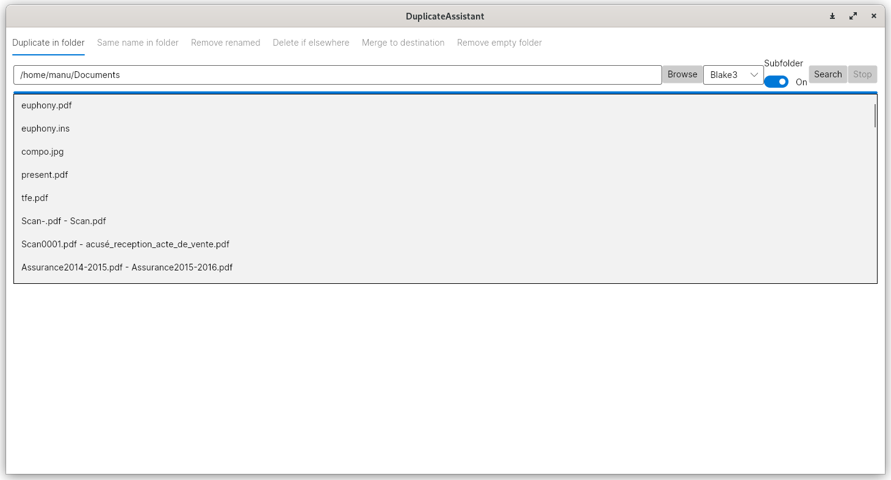

# DuplicateFileAssistant
Utility tool to find duplicate files on the system.

The application is built on top of dotnet and works at least on Windows and Linux.

Different kind of file hashing are supported as well as fast file compare with SIMD.

This tool is still under development, use it at your own risk.